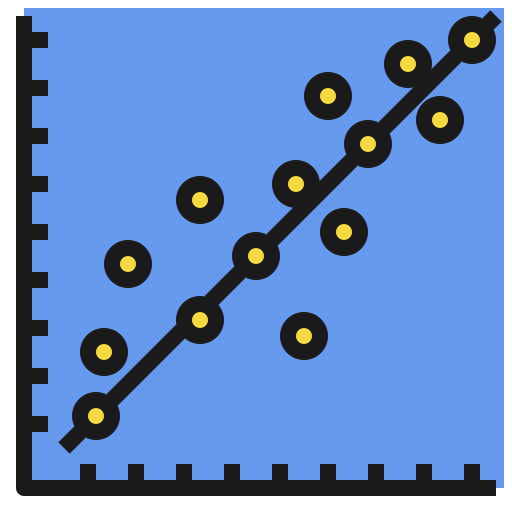
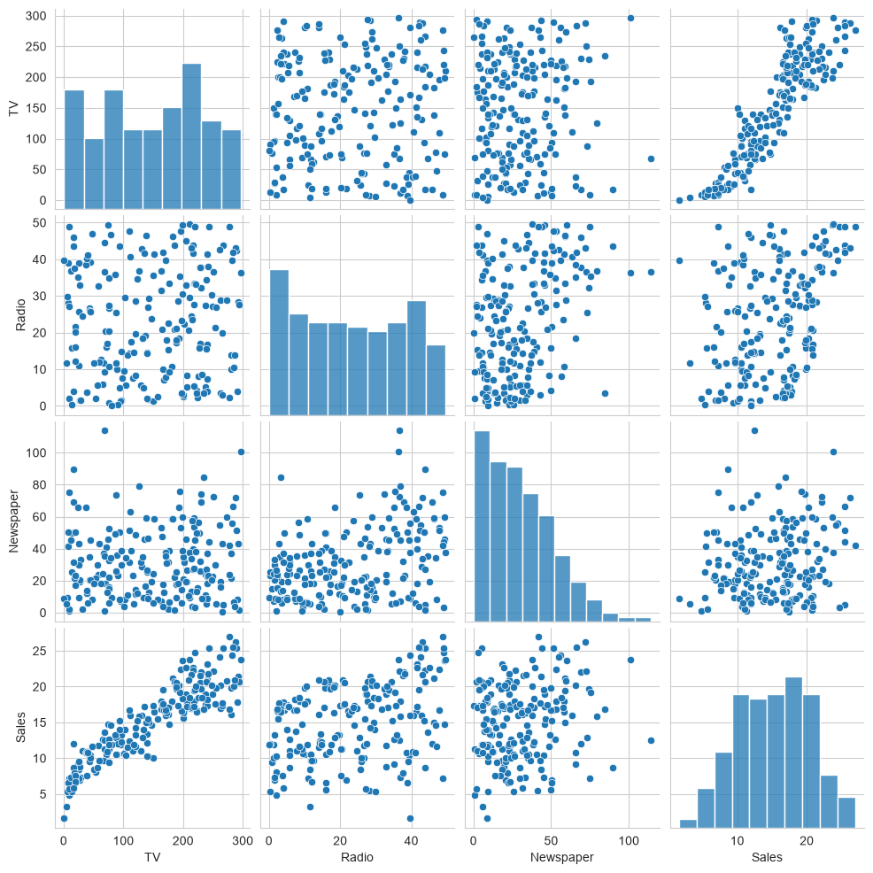
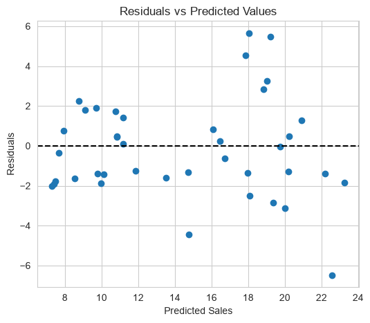
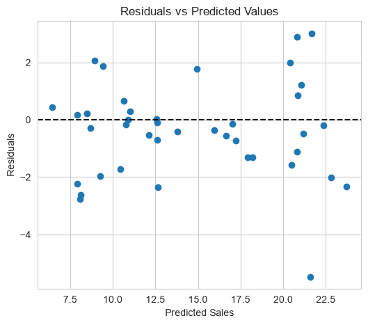

# Linear Regression Using NumPy 

This project demonstrates how to implement **Simple Linear Regression** and **Multiple Linear Regression** **from scratch using only NumPy**, without relying on machine learning libraries such as Scikit-learn.

The project uses the [**Advertising**](advertising.csv) dataset to predict product **Sales** based on advertising budgets. It provides a step-by-step implementation of the **Normal Equation**, enabling a deeper understanding of the mathematical concepts behind linear regression.

#### Key features of the project include,

- Implementation of **Simple Linear Regression** using the **TV** advertising budget as the input feature.

- Implementation of **Multiple Linear Regression** using **TV**, **Radio**, and **Newspaper** advertising budgets as input features.

- Manual implementation of the **Normal Equation** using NumPy matrix operations without relying on external machine learning libraries.

- Random shuffling and splitting of the dataset into **80% training** and **20% testing** sets.

- Performance evaluation using **Root Mean Squared Error (RMSE)**.

- Residual analysis to assess prediction errors and model performance.

- Prediction of sales for new advertising budgets using the trained simple / multiple regression models.

#### Project Structure

```
linear-regression-using-numpy/
│
├── simple linear regression using numpy.ipynb
├── multiple linear regression using numpy.ipynb
├── advertising.csv
├── assets/
│   ├── pairplot.png
│   ├── simple-residual-plot.png
│   └── multiple-residual-plot.png
└── README.md
```

---

## Dataset

The project uses the **Advertising** dataset containing advertising expenditures across three different media channels.

| Feature | Description |
|----------|-------------|
| TV | TV advertising budget |
| Radio | Radio advertising budget |
| Newspaper | Newspaper advertising budget |
| Sales | Product sales (Target Variable) |

---

## Project Workflow

Both notebooks follow the same machine learning workflow:

1. Load the dataset.
2. Explore the dataset.
3. Perform data visualization.
4. Prepare input features and target values.
5. Shuffle the dataset.
6. Split the dataset into training and testing sets.
7. Train the Linear Regression model using the **Normal Equation**.
8. Predict sales for training and testing datasets.
9. Evaluate model performance using **RMSE**.
10. Perform residual analysis.
11. Predict sales for unseen advertising budgets.

---

## Mathematical Model

The regression model is trained using the **Normal Equation**.

<p align="center">

**W = (XᵀX)<sup>-1</sup>XᵀY**

</p>

where,

- **W** = Model weights
- **X** = Feature matrix
- **Y** = Target values

The implementation makes use of NumPy matrix operations such as:

- Matrix multiplication
- Matrix transpose
- Matrix inversion
- Bias term addition

without using any external machine learning frameworks.

---

## Data Visualization

The Simple Linear Regression notebook includes a pairwise visualization of the dataset to identify relationships between variables.

### Pairplot

<!-- Replace with actual image -->



---

## Residual Analysis

Residual plots are generated after training the models to analyse prediction errors.

### Simple Linear Regression Residual Plot

<!-- Replace with actual image -->



### Multiple Linear Regression Residual Plot

<!-- Replace with actual image -->



---

## Model Performance

### Simple Linear Regression

| Metric | Value |
|---------|-------|
| Training RMSE | **2.2357** |
| Testing RMSE | **2.4700** |

Prediction Example

```
TV = 220

Predicted Sales = 19.2134
```

---

### Multiple Linear Regression

| Metric | Value |
|---------|-------|
| Training RMSE | **1.6359** |
| Testing RMSE | **1.7052** |

Prediction Example

```
TV = 220
Radio = 30
Newspaper = 10

Predicted Sales = 19.7779
```

---

## Used Technologies

- Python
- NumPy
- Pandas
- Matplotlib
- Seaborn
- Jupyter Notebook

#### Used Integrated Development Environment

- IntelliJ IDEA

---

## How to Use?

- Clone this repository to your local machine.

```bash
git clone https://github.com/PubuduJ/linear-regression-using-numpy.git
```

- Navigate to the project directory.

```bash
cd linear-regression-using-numpy
```

- Install the required dependencies.

```bash
pip install -r requirements.txt
```

or

```bash
pip install numpy pandas matplotlib seaborn
```

- Open either notebook using Jupyter Notebook or your preferred IDE.

- Run all notebook cells sequentially to reproduce the results.

---

## Learning Outcomes

This project demonstrates how to:

- Implement Linear Regression from scratch using NumPy.
- Apply the Normal Equation for parameter estimation.
- Perform matrix operations required for machine learning.
- Split datasets into training and testing sets.
- Evaluate regression models using RMSE.
- Analyse residuals to assess model performance.
- Predict outputs for unseen data.

---

## Version

v1.0.0

---

## License

Copyright &copy; 2026 [**Pubudu Janith**](https://www.linkedin.com/in/pubudujanith/). All Rights Reserved.

This project is licensed under the [**MIT License**.](LICENSE.txt)